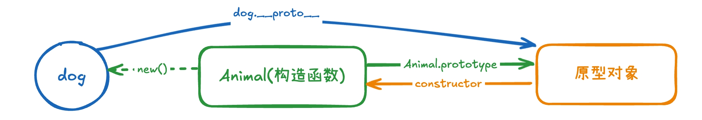
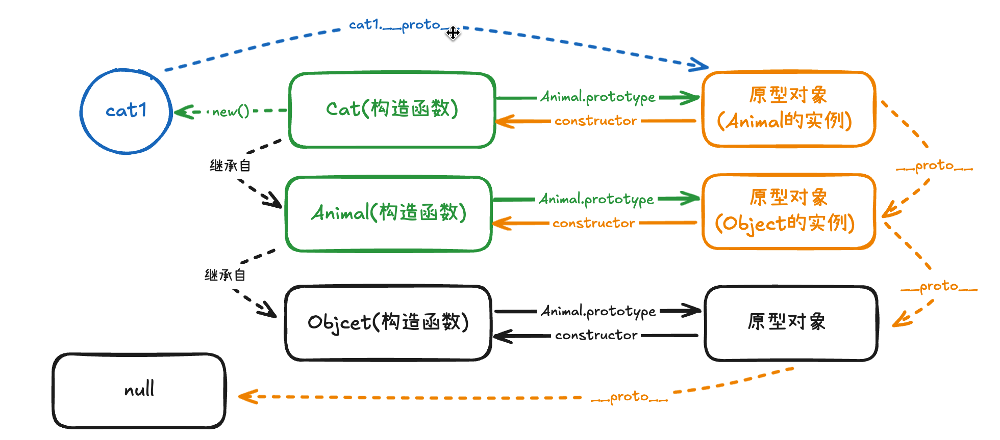

# 深入理解 instanceof 操作符：从原理到手写实现

# 什么是 instanceof 操作符

`instanceof` 是 JavaScript 中的一个操作符，用于检查一个对象是否是某个构造函数的实例，或者是否在其原型链中存在该构造函数的原型。

```javascript
function Animal(name, age) {
  this.name = name;
  this.age = age;
}

const dog = new Animal('Pity', 2);

console.log(dog instanceof Animal);    // true
console.log(dog instanceof Object);    // true (因为所有对象都继承自Object)
console.log(dog instanceof Array);     // false
```
# instanceof 的工作原理

要深入理解 `instanceof` 的工作原理，我们需要先了解 JavaScript 中的原型链机制。

## 原型链关系

在第一部分的例子中，当我们使用 `new` 关键字创建一个对象时，JavaScript 会帮我们进行以下几步操作：

1. 创建一个新的空对象
2. 将这个新对象的 `__proto__` 属性指向 `Animal.prototype`，同时将 `Animal` 构造函数中的 `this` 指向这个新对象
3. 执行 `Animal` 构造函数，给新对象添加属性
4. 返回这个新对象

这样，我们就得到了一个 `dog` 对象，它和 `Animal` 构造函数之间建立了一种特殊的联系。这种联系就是通过原型链来实现的：



从图中我们可以看到：
- 构造函数 `Animal` 通过 `prototype` 指向其原型对象
- 其原型对象又通过 `constructor` 指向构造函数 `Animal`
- `dog` 对象通过 `__proto__` 属性指向 `Animal.prototype`

这里需要特别说明的是，在 JavaScript 中，每个函数都有一个 `prototype` 属性，这个属性指向一个对象，我们称之为"原型对象"，普通函数也有原型对象，只不过往往构造函数的原型才会真正派上用场。

原型对象通常是该构造函数的父类的实例。比如，`Animal` 默认继承自 `Object`，所以 `Animal.prototype` 本质上就是 `Object` 的一个实例。这就是为什么我们常说"原型对象就是父类的实例"。Object类是一个例外，因为它是原型链的起点。

这种继承关系形成了一个链条：当我们访问 `dog` 对象的属性时，JavaScript 会：
1. 先在这个对象本身查找
2. 如果找不到，就通过 `__proto__` 找到 `Animal.prototype` 继续查找
3. 如果还找不到，就继续通过 `__proto__` 找到 `Object.prototype` 查找
4. 直到找到这个属性，或者到达链子的尽头（`null`）

这就是 JavaScript 中的原型链。它就像一条链子，把对象和它的"祖先"们连接在一起。这种机制不仅让我们能够实现继承，也是 `instanceof` 操作符能够工作的基础。



在上图中有着更加复杂的继承关系， `Cat` 继承自 `Animal`，`Animal` 又默认继承自 `Object`，原型链变得更长，但原理是一样的。每个对象都能通过 `__proto__` 找到它的"父亲"，而"父亲"又能找到"祖父"，这样一层层往上，直到找到最顶层的 `Object.prototype`。

## instanceof 的判断过程

当执行 `object instanceof constructor` 时，JavaScript 会：

1. 获取 `object` 的 `__proto__` 属性
2. 获取 `constructor` 的 `prototype` 属性
3. 比较这两个值是否相等
4. 如果不相等，则沿着原型链向上查找，直到找到相等的值或到达原型链顶端（null）

# 手写函数模拟 instanceof 操作符

在理解了 `instanceof` 操作符的工作原理后，我们可以尝试手动实现一个类似的函数。这个实现过程主要包含以下几个关键点：

1. 由于 `instanceof` 操作符**只能用于对象类型的判断**，如果传入的是基本数据类型（如数字、字符串等），我们应该直接返回 false。

2. 其次，我们需要获取对象的原型与构造函数的原型进行对比，如果对比结果相同则直接返回 true 。需要注意的是，JavaScript 提供了更加规范的方式来获取对象的原型：`Object.getPrototypeOf()` 而不是直接访问 `__proto__` 属性。

3. 最后，我们需要沿着原型链向上查找，让对象的原型与构造函数继续执行上述判断逻辑。如果判断完整个原型链都没有找到匹配的原型，则返回 false。

为了帮助大家更好地理解实现过程，我们提供了两种不同的实现方式：一种是使用**递归**的方式，通过函数自身调用来遍历原型链；另一种是使用**循环**的方式，通过 while 循环来实现相同的功能。

```javascript
const instanceOf = (left, right) => {
  // 类型守卫 —— 基本类型直接返回 false
  if (typeof left !== "object" && typeof left !== "function" || left === null) {
    return false;
  }
  // 1. 递归方式实现
  if (Object.getPrototypeOf(left) === right.prototype) {
    return true;
  } else {
    return instanceOf(Object.getPrototypeOf(left), right);
  }
  // 2. 循环方式实现
  let proto = Object.getPrototypeOf(left);
  while (true) {
    if (proto === null) return false;
    if (proto === right.prototype) return true;
    proto = Object.getPrototypeOf(proto);
  }
};

function Animal(name) {
  this.name = name;
}
const dog = new Animal("dog");
const arr = [];
const str = "123";
console.log(instanceOf(arr, Array)); // true
console.log(instanceOf(str, String)); // false
console.log(instanceOf(dog, Animal)); // true
console.log(instanceOf(dog, Object)); // true
```

在上面的测试代码中，我们发现了一个有趣的现象：使用字面量创建的数组 `[]` 和字符串 `"123"` 在与它们的构造函数进行 `instanceof` 判断时，得到了**不同的结果**。数组返回 `true`，而字符串返回 `false`。

在 JavaScript 中，数据类型可以分为两大类：**值类型**（原始类型）和**引用类型**（对象类型）。数组虽然可以通过字面量语法 `[]` 创建，但它本质上是一个引用类型。这种字面量语法实际上是 `new Array()` 的简写形式，所以当我们使用 `instanceof` 判断时，它会正确地返回 `true`。

而字符串 `"123"` 则是一个值类型。虽然我们可以在字符串上调用方法（比如 `"123".length`），但这点依赖 JavaScript 的**自动装箱机制**：当我们需要访问字符串的属性或方法时，JavaScript 会临时创建一个 String 对象，使用完后立即销毁。这个临时的对象包装并不会改变字符串本身的值类型本质，因此 `instanceof` 判断会返回 `false`。

## 总结

本文深入剖析了 JavaScript 中 instanceof 操作符的工作原理，从原型链机制到具体的判断过程，最终实现了两种手写方案。通过递归和循环两种实现方式，我们不仅理解了 instanceof 的底层机制，还掌握了如何区分值类型和引用类型的判断逻辑。
