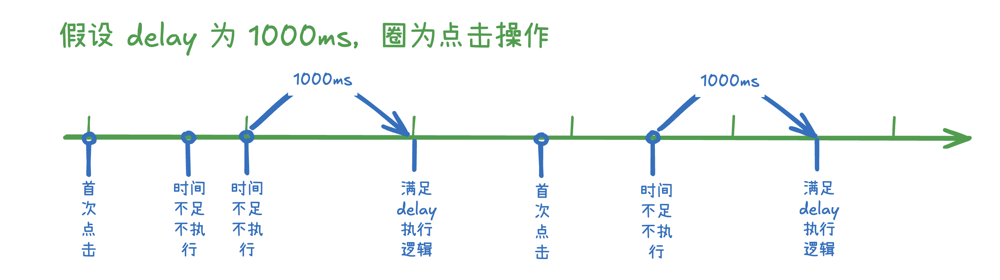
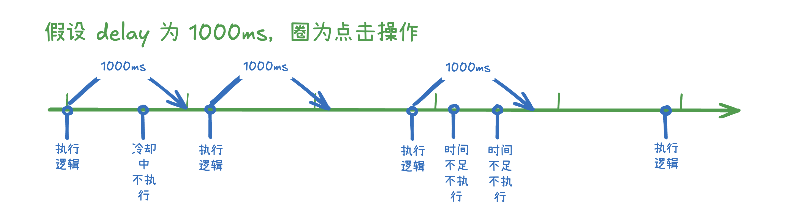

# 防抖与节流

## 一、为什么需要防抖与节流

在日常前端开发过程中，一个页面往往会存在大量的交互行为，例如：用户在搜索框中快速输入文字，每次按键都会触发搜索请求；用户频繁地滚动页面，每次滚动都会执行计算；用户在系统登录页面中，由于网络延迟焦急地多次点击登录按钮，每次都会触发登录逻辑，在这些高频率的事件触发中，往往会存在性能问题。

让我们通过具体的例子来理解这个问题：

```javascript
// 某个页面的模糊搜索函数
const handleSearch = (query) => {
  for (let i = 0; i < 1000000; i++) {
    // 模拟网络请求或复杂计算，这里需要花费一部分时间
  }
};

// 用户在模糊搜索框中输入内容，每次输入都执行搜索操作
const searchInput = document.getElementById("search");
searchInput.addEventListener("input", (e) => {
  handleSearch(e.target.value);
});
```

在上面的代码中，如果用户快速输入 "HelloWorld"，那么会触发 10 次搜索操作，这是我们不需要的。我们想要**限制搜索执行的频率**，**在用户停止输入后再执行搜索**。

防抖与节流就是为了优化这类高频事件的处理，减少重复、不必要的逻辑执行。

## 二、防抖与节流的概念解析

防抖和节流是两种不同的控制方案：

### 防抖（Debounce）

**防抖**就像一个耐心的服务员服务员，它会等待客人完全停止点菜后才去厨房下单。无论客人在这期间改了多少次主意，服务员都会重新开始等待，直到客人真正确定下来。

防抖的核心思想是：**在事件被触发 n 秒后再执行回调函数，如果在这 n 秒内又被触发，则重新计时**。



### 节流（Throttle）

**节流**会在第一次触发时开启计时，在计时期间无论函数被调用多少次都不会被触发，直到计时结束。

节流的核心思想是：**限制函数的执行频率，无论事件触发多么频繁，都保证在规定时间内只执行一次**。



### 两者的区别

我曾经在 B 站上看到过一个节流和防抖的举例：

- 防抖就像是回城，只要中间被打断就要重新开始计时。
- 节流就像是英雄技能的 CD，使用过之后就要开始进入冷却，直到冷却时间结束才能再次触发。

我们通常根据具体的业务场景选择这两种控制策略，例如前面搜索框的例子中，我们需要等用户输入完才开始执行搜索，那这种场景就很适合防抖。而在登录页的例子中，为了防止用户频繁点击登录按钮，我们需要在用户第一次点击时触发，并且在一段时间内只执行一次登录逻辑，这种场景就很适合节流。

## 三、防抖的实现与应用

我们会从最基础的防抖开始实现，逐步开始支持 immediate 模式（立即执行模式）、可取消模式。

### 1. 基础防抖实现

防抖的**核心原理**是通过 `setTimeout` 来延迟函数的执行，并在新的事件触发时清除之前的定时器。这确保了只有在指定的延迟时间内没有新的事件触发时，函数才会真正执行。在实现上，我们通过返回一个闭包函数来为传入的函数添加防抖功能。

> **闭包的特性** ：即使外部函数已经执行完毕，内部函数仍然可以访问外部函数中的变量。在防抖实现中，我们在闭包函数外定义了 timer 变量以便于我们持久化存储定时器实例（而不是每次都定义一个新的），这样即使 debounce 函数执行完毕，也可以在返回的函数中使用 timer 变量。

```javascript
const debounce = (func, delay) => {
  let timer = null;
  return function (...args) {
    // 清除之前的定时器，并开启一个新的计时器
    clearTimeout(timer);
    timer = setTimeout(() => {
      func.apply(this, args);
    }, delay);
  };
};

const handleSearch = (value) => {
  console.log(`执行模糊搜索操作: ${value}`);
};

const handleSearchWithDebounce = debounce(handleSearch, 300);

handleSearchWithDebounce("a");
handleSearchWithDebounce("ab");
handleSearchWithDebounce("abc"); // 只有这个会在 300ms 后执行，并打印出 "abc"
```

---

在 JavaScript 中，**setTimeout 的回调函数（如 setTimeout(() => { ... }, delay)）的调用方式是独立于原始调用栈的**，这就导致了在不进行任何操作的情况下使用直接在防抖函数的 setTimeout 里执行原函数会丢失掉上下文。

在上面的代码实现中，我们在使用了 apply 方法目的是 **防止在特定场景中丢失期望的 this 指向** ，我们可以看一下这个例子，很明显 greet 方法里使用的 this 期望指向是 student：

```javascript
const student = {
  name: "Alice",
  greet: debounce(function (e) {
    console.log(`Hello, ${this.name}`); // 期望 this 是 student
  }, 300),
};
```

我们详细看一下 this 的指向链路，当我们**使用 student.greet 调用防抖函数返回的闭包函数时，闭包函数内部的 this 会自动指向 student（this 绑定规则）**，我们在 setTimeout 内传入了一个箭头函数，箭头函数里的 this 会继承外层的上下文（student），所以当执行 apply 方法时，this 指向的就是 student。

但是如果我们在防抖函数中不使用 apply 方法，那么在真正执行 greet 方法时，this.name 就可能因为无法正确找到 student 对象而报错。

### 2. 支持 immediate 模式

有时我们希望函数能够**先立即执行一次**，然后在指定时间内忽略后续的调用。比如用户在系统登录页面中，由于网络延迟焦急地多次点击登录按钮，每次都会触发登录逻辑，我们就会希望用户在频繁点击的第一次会调用登录逻辑，后续的频繁点击都不会触发：

```javascript
const debounce = (func, delay, immediate = false) => {
  let timer = null;
  return function (...args) {
    clearTimeout(timer);
    timer = setTimeout(() => {
      timer = null;
      if (!immediate) {
        // 如果是 immediate 就不再执行了，因为已经在刚开始的时候执行过了
        func.apply(this, args);
      }
    }, delay);
    if (immediate && !timer) {
      // 当定时器没有开始计时且为immediate时会直接执行
      func.apply(this, args);
    }
  };
};

const handleLogin = () => console.log("登录操作");
const handleLoginWithDebounce = debounce(handleLogin, 2000, true);

handleLoginWithDebounce(); // 执行登录操作
handleLoginWithDebounce(); // 2000毫秒内的再次点击不会再执行
```

### 3. 支持主动取消防抖

在某些情况下，我们可能需要在开始调用防抖函数但是还未开始执行时 **主动取消** 防抖函数的执行，由于防抖函数内的实际逻辑通过定时器触发执行的，我们只需要清除掉防抖函数中的定时器即可（immediate 模式无法取消，因为会在第一次调用就会被执行，清除定时器也无法取消，所以下面的例子中根据普通的防抖函数改造）：

```javascript
const debounce = (func, delay) => {
  let timer = null;
  const debounced = function (...args) {
    clearTimeout(timer);
    timer = setTimeout(() => {
      func.apply(this, args);
    }, delay);
  };
  // 添加取消方法，清除定时器
  debounced.cancel = () => {
    clearTimeout(timer);
    timer = null;
  };
  return debounced;
};

const handleSearchWithDebounce = debounce((query) => {
  console.log(`搜索: ${query}`);
}, 500);

handleSearchWithDebounce("JavaScript"); // 这条内容不会被打印，因为执行了取消函数
handleSearchWithDebounce.cancel();
```

## 四、节流的实现与应用

节流的**核心原理**是控制函数的执行频率。与防抖不同，节流保证函数在指定的时间间隔内最多执行一次。我们也会从最基础的节流开始实现，逐步开始控制 leading（首次是否执行）和 trailing（最后一次是否执行）。

### 1. 基础节流实现

这种实现方式会在**第一次触发时立即执行**，然后在指定时间间隔内忽略后续的触发，在下面的代码中，我们实现了定时器和时间戳两个版本的节流函数，它们的功能是基本一致的：

```javascript
const throttle1 = (func, delay) => {
  // 使用时间戳实现节流
  let lastTime = 0;
  return function (...args) {
    const nowTime = Date.now();
    const remainTime = delay - (nowTime - lastTime);
    if (remainTime <= 0) {
      func.apply(this, args);
      lastTime = nowTime;
    }
  };
};

const throttle2 = (func, delay, leading = true) => {
  // 使用定时器实现节流
  let timer = null;
  return function (...args) {
    if (!timer) {
      func.apply(this, args);
      timer = setTimeout(() => {
        timer = null;
      }, delay);
    }
  };
};

// 使用示例
const handleScroll = () => {
  console.log("滚动事件处理", window.scrollY);
};

const throttledScroll = throttle2(handleScroll, 100);
window.addEventListener("scroll", throttledScroll);
```

### 2. 支持 leading 参数控制第一次是否执行

我们可以对我们的节流函数进行一些改造，允许传入 leading 参数（默认值为 true），当该参数为 false 时，首次调用节流函数不执行逻辑。我们基于第一版的基础节流函数进行改造：

```javascript
const throttle1 = (func, delay, { leading = true } = {}) => {
  // 使用时间戳实现节流
  let lastTime = 0; // 第一次调用时，时间戳为 0
  return function (...args) {
    const nowTime = Date.now();
    // 当 第一次调用 且 leading = true 时，直接把 lastTime 置为当前时间但不执行函数逻辑（相当于第一次不执行）
    if (lastTime === 0 && !leading) lastTime = nowTime;
    const remainTime = delay - (nowTime - lastTime);
    if (remainTime <= 0) {
      func.apply(this, args);
      lastTime = nowTime;
    }
  };
};

const throttle2 = (func, delay, { leading = true } = {}) => {
  // 使用定时器实现节流
  let timer = null;
  let isFirst = true; // 记录是否是第一次调用
  return function (...args) {
    if (!timer && (leading || !isFirst)) {
      // 当 leading 为 false 且 第一次调用 时不执行该代码块的逻辑
      func.apply(this, args);
      timer = setTimeout(() => {
        timer = null;
      }, delay);
    } else if (!timer) {
      timer = setTimeout(() => {
        isFirst = false; // 当 leading 为 false 且 第一次调用 时，把 isFirst 置为 false
        timer = null;
      }, delay);
    }
  };
};

const handleMouseMove = (e) => {
  console.log(`鼠标位置: (${e.clientX}, ${e.clientY})`);
};
// 无需立即执行
const throttledMouseMove = throttle2(handleMouseMove, 100, { leading: false });

document.addEventListener("mousemove", throttledMouseMove);
```

需要注意的是，其实这个例子中我们的节流函数有一些缺陷，我们期望每次节流操作的首次触发单独计算，但我们的函数在运行时只有第一次节流操作的首次触发才不会执行，这一点我们将在下面通过定时器进行完整实现。

### 3. 支持传入 trailing 参数控制是否尾部执行

要想实现尾部执行，我们就不再使用定时器来实现原有的基础节流功能了，因为我们需要根据当前时间间隔的剩余时间创建新的定时器来在尾部执行相应逻辑，剩余时间的计算依赖于时间戳，所以在下面的代码示例中我们就只使用时间戳来实现基础功能，用定时器单独实现尾部执行逻辑。

```javascript
const throttle = (func, delay, { leading = true, trailing = false } = {}) => {
  let lastTime = 0; // 第一次调用时，时间戳为 0
  let timer = null; // 通过定时器来实现尾部执行功能
  return function (...args) {
    const nowTime = Date.now();
    // 当 第一次调用 且 leading = true 时，直接把 lastTime 置为当前时间但不执行函数逻辑（相当于第一次不执行）
    if (lastTime === 0 && !leading) lastTime = nowTime;
    const remainTime = delay - (nowTime - lastTime);
    if (remainTime <= 0) {
      if (timer) {
        clearTimeout(timer); // 如果下次执行时定时器未清空则清除定时器，防止重复执行
        timer = null;
      }
      func.apply(this, args);
      lastTime = nowTime;
    } else if (trailing && !timer) {
      timer = setTimeout(() => {
        func.apply(this, args);
        // 如果 leading 为false，则设置为 0，否则为当前时间，确保在每次真正执行节流操作时都能够对 leading 参数进行响应
        lastTime = leading ? Date.now() : 0;
        timer = null;
      }, remainTime);
    }
  };
};

// 使用示例：可配置的节流
const handleMouseMove = (e) => {
  console.log(`鼠标位置: (${e.clientX}, ${e.clientY})`);
};

const throttledMouseMove = throttle(handleMouseMove, 100, {
  leading: false,
  trailing: true,
});

document.addEventListener("mousemove", throttledMouseMove);
```
