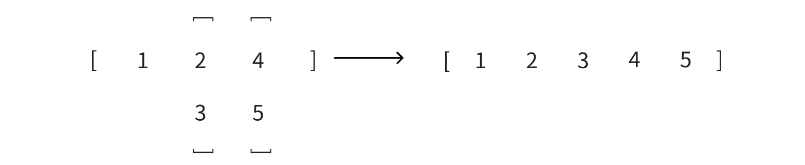
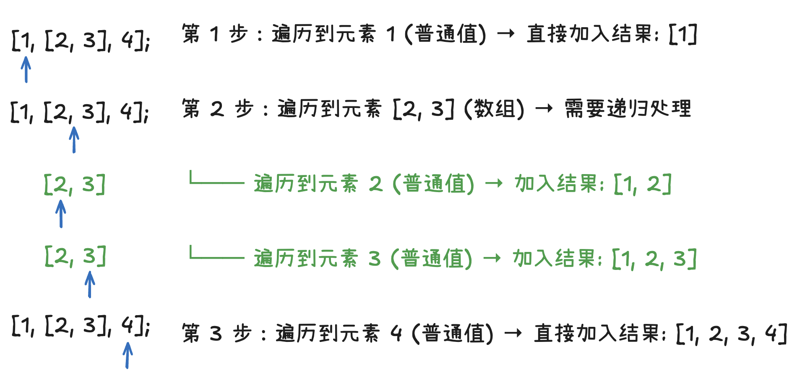
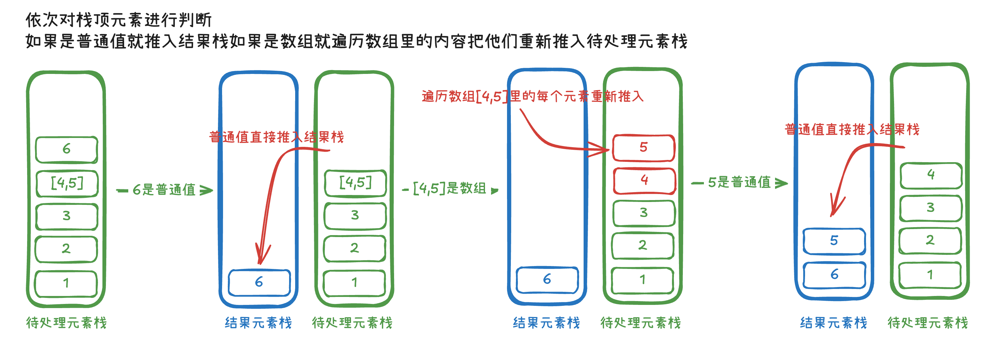

# 数组扁平化详解

## 一、前言

在日常开发中，我们往往需要将多维数组（嵌套数组）展开为一维数组，这种操作我们称为"**数组扁平化**"。举个例子，将数组`[1,[2,3][4,5]]`扁平化后，得到的新数组就是`[1,2,3,4,5]`。



实际上，ES6 已经为数组提供了原型方法 `flat()` 来实现扁平化操作，该方法支持**自定义扁平化深度**：

```javascript
const arr = [1, [2, [3, [4]], 5]];

// 默认只扁平化一层
console.log(arr.flat());
// 输出: [1, 2, [3, [4]], 5]

// 指定扁平化深度
console.log(arr.flat(2));
// 输出: [1, 2, 3, [4], 5]

// 完全扁平化（无限深度）
console.log(arr.flat(Infinity));
// 输出: [1, 2, 3, 4, 5]
```

本文将通过 **ES5** 和 **ES6** 两种不同的语法风格，分别实现数组扁平化操作。

## 二、ES5 语法实现数组扁平化

### 基本思路分析

由于 **ES5** 语法中并没有类似于**迭代器**的语法，所以我们在手动实现数组扁平化时只能依靠**递归**来进入每个嵌套数组的内部，提取出每个嵌套数组中的元素。

在这个过程中，我们需要定义一个新的数组用来存储扁平化后的数据，同时在**闭包函数**中操作这个数组，在每个"**单次扁平化操作**"中将结果存放在这个数组中。

**核心思路**：

1. **遍历数组**中的每一个元素
2. 如果元素是**普通值**，直接放入**结果数组**
3. 如果元素是**数组**，就"进入"这个数组，继续处理里面的元素
4. **重复这个过程**，直到所有嵌套都被处理完

### 基础实现版本

```javascript
function flatArray(array) {
  // 首先检查输入是否为数组，如果不是就直接返回
  if (!Array.isArray(array)) {
    return array;
  }
  // result 用来存放扁平化后的数组
  var result = [];
  // 单层扁平化方法
  function flat(arr) {
    // 对数组进行遍历
    for (var i = 0; i < arr.length; i++) {
      if (Array.isArray(arr[i])) {
        // 如果数组元素仍然是数组的情况，则递归调用"单层扁平化"方法
        flat(arr[i]);
      } else {
        // 如果不是数组的情况，则直接将元素添加到结果数组中
        result.push(arr[i]);
      }
    }
  }
  // 开始扁平化处理
  flat(array);
  return result;
}

const example = [1, [2, 3], 4];
console.log("示例结果:", flatArray(example)); // [1, 2, 3, 4]
```

我们简单拆解一下上面的例子中，example 数组的扁平化流程



### 支持指定深度

有时候我们不想**完全扁平化**数组，而是只想扁平化**指定的层数**。比如只展开最外层的数组，里面更深层的数组保持不变。

其实我们只需要在单层扁平化的操作中增加对**层数的判断**，超出层数的元素即便是数组我们也当做**普通值处理**即可。

```javascript
function flatArray(array, depth = 1) {
  if (!Array.isArray(array)) {
    return array;
  }
  // result 用来存放扁平化后的数组
  var result = [];
  // 单层扁平化方法
  function flat(arr, currentDepth) {
    // 对数组进行遍历
    for (var i = 0; i < arr.length; i++) {
      if (Array.isArray(arr[i]) && currentDepth > 0) {
        // 如果数组元素仍然是数组的情况，则递归调用”单层扁平化“方法
        flat(arr[i], currentDepth - 1);
      } else {
        // 如果不是数组的情况，则直接将元素添加到结果数组中
        result.push(arr[i]);
      }
    }
  }
  // 开始扁平化处理
  flat(array, depth);
  return result;
}

const arr = flatArray([1, [4, 5], 7, 8, 9, [10, 11, [12, 13]]], 1);

console.log("扁平化结果:", arr); // [ 1, 4, 5, 7, 8, 9, 10, 11, [ 12, 13 ] ]
```

### 不使用闭包实现数组扁平化 —— 参数传递

在上述代码中，我们使用闭包的目的是为了能够**在递归流程中始终能够访问到存放结果的数组，并可以对其进行操作**。

由于数组是引用类型，我们可以通过每次递归调用”单层扁平化方法“时手动将结果数组的引用作为参数传递进来，这样就可以直接在每次的扁平化操作中直接操作结果数组了。

```javascript
function flatArray(arr, result) {
  if (!Array.isArray(array)) {
    return array;
  }
  result = result || []; // 初始化结果数组
  for (var i = 0; i < arr.length; i++) {
    if (Array.isArray(arr[i])) {
      flatArray(arr[i], result); // 传递结果数组的引用
    } else {
      result.push(arr[i]);
    }
  }
  return result;
}

// 使用方式
var arr = [1, [2, [3, 4]], 5];
console.log(flatArray(arr)); // [1, 2, 3, 4, 5]
```

### 不使用递归实现数组扁平化 —— 栈思想

> 栈是一种特殊的线性表结构，它只允许在固定的一端去删除数据和插入数据，对于进行插入和删除操作的地方叫做栈顶，另一端叫做栈底，栈中的数据元素遵从后进先出（LIFO）的原则。

使用**栈思想**处理数组扁平化的核心步骤为：

1. 将**原始数组**作为**初始栈内容**
2. **循环**从**栈顶取出元素**，如果当前元素是数组，则将其内部元素**压入栈中**，如果当前元素不是数组，则加入**结果栈**
3. 直到**栈为空**为止

以嵌套数组 `[1,2,3,[4,5],6]` 为例，它的处理流程如下图所示：



在 JavaScript 中，我们可以使用**数组**来**模拟栈结构**，使用数组的 `pop()` 方法模拟**出栈行为**，`push()` 方法模拟**入栈行为**。

需要特殊注意的是，由于我们使用原始数组作为**初始栈**，根据**后进先出**原则，每次出栈都是从数组的**末尾元素**往前开始处理扁平化的。同时在结果栈中，根据后进先出原则，**末尾元素先进栈**。由于我们是使用的数组来模拟栈结构，最终输出数组的时候还需要把结果数组 `reverse` 一下，才能保证输出的数组**元素顺序一致**。

```javascript
function flatArray(arr) {
  // 首先检查输入是否为数组，如果不是就直接返回
  if (!Array.isArray(arr)) {
    return arr;
  }
  var stack = arr.slice(); // 使用数组模拟栈，注意：要对原数组进行浅拷贝，否则会影响原数组
  var result = []; // 结果栈（数组），用于存放扁平化后的元素
  while (stack.length > 0) {
    var top = stack.pop(); // 取出栈顶元素，并从栈中移除
    if (Array.isArray(top)) {
      // 如果栈顶元素是数组，则将数组中的元素依次压入栈中
      for (let i = 0; i < top.length; i++) {
        stack.push(top[i]);
      }
    } else {
      // 如果栈顶元素不是数组，则将元素加入结果栈中
      result.push(top);
    }
  }
  // 将结果栈中的元素逆序，因为栈是后进先出的，所以需要逆序
  return result.reverse();
}

const example = [1, [2, 3], 4];
console.log("示例结果:", flatArray(example)); // [1, 2, 3, 4]
```

**栈结构的优势**：相比递归方法，栈结构能够避免深层嵌套数组导致的栈溢出问题。

> 💡 **简单理解**：JavaScript 也是通过栈结构来处理和跟踪函数调用逻辑的，每次函数调用时：一个新的栈帧被压入调用栈，包含函数的参数、局部变量和返回地址等信息。函数执行完毕后：对应的栈帧从调用栈弹出，控制权返回到调用位置。

而使用栈结构的迭代方法，无论数组多深都不会有这个问题，因为我们只是在循环中处理数据，不会产生大量的函数调用。

## 三、ES6 语法实现数组扁平化

ES6 提供了更多简洁优雅的方式来实现数组扁平化，代码更加简洁易读。

🌰 举个例子：我们之前在使用栈结构处理数组扁平化时，**浅拷贝原数组**、**遍历数组**取出数组里的每个元素都可以使用 ES6 的**拓展运算符**来实现：

```javascript
if (Array.isArray(top)) {
  // 如果栈顶元素是数组，则将数组中的元素依次压入栈中
  stack.push(...top);
} else {
  // 如果栈顶元素不是数组，则将元素加入结果栈中
  result.push(top);
}
```

### reduce 实现数组扁平化

> reduce 是 JavaScript 数组的一个高阶函数，使用方法为：`array.reduce(每个数组元素执行的函数,累积器的初始值)`。reduce 函数会对数组中的每个元素依次执行回调函数，并最终返回累积器的值。

> reduce 方法接收回调函数为：`(累积器, 当前值, 当前索引) => {}`。函数有至少定义两个参数：第一个参数为累积器变量，第二个参数为正在遍历到的数组元素，第三个参数（可选）为正在遍历到的数组元素索引。

要使用 `reduce` 方法实现数组扁平化，实际上就是对我们在上文中提到的 ES5 对数组扁平化的基础操作进行简化替换。

- 用 `reduce` 提供的 **累积器** 来替换在函数内**手动定义的结果数组**
- `reduce` 会**自动对每个元素执行回调函数**，我们无需手动遍历数组
- 由于每个回调函数都可以读取到累积器的值，所以**闭包函数也就不需要了**

```javascript
function flatArray(array) {
  return array.reduce((acc, val) => {
    if (Array.isArray(val)) {
      return [...acc, ...flatArray(val)];
    }
    return [...acc, val];
  }, []);
}

const example = [1, [2, 3], 4];
console.log("示例结果:", flatArray(example)); // [1, 2, 3, 4]
```

想要**支持深度**的话也很简单，和之前一样：我们只需要在单层扁平化的操作中增加对**层数的判断**，超出层数的元素即便是数组我们也当做**普通值处理**即可。

```javascript
function flatArray(array, depth = 1) {
  return array.reduce((acc, val) => {
    if (depth > 0 && Array.isArray(val)) {
      return [...acc, ...flatArray(val, depth - 1)];
    }
    return [...acc, val];
  }, []);
}
const example = [1, [2, [3]], 4];
console.log("示例结果:", flatArray(example, 1)); // [1, 2, [3], 4]
```

### 拓展运算符与 concat 的结合实现数组扁平化

在 ES6 语法中，`array.some()` 方法可以轻松实现对数组中是否存在嵌套数组的检测。

> array.some() 方法需要传入一个回调函数，数组中的每个元素都会执行该回调函数，回调函数需要返回一个布尔值，当时数组中有元素执行回调函数返回了 `true` 时，该方法返回 `true`。

在存在**嵌套数组**的情况下，可以使用**拓展运算符展开**后，使用 `concat` **合并到结果数组**中，直到结果数组中**没有嵌套数组**为止。

> concat 是常见的数组合并方法，用于合并两个或多个数组。 concat 的参数中可以传递数组，也可以传递普通值，当传递的是数组的时候，会和原数组进行数组合并，当传递的是普通值的时候，追加到数组中。它不会改变现有数组，而是返回一个新数组。

```javascript
function flatArray(array) {
  let result = [...array]; // 结果数组（使用浅拷贝，防止修改原数组）
  // 只要数组中还有数组元素就继续循环
  while (result.some((item) => Array.isArray(item))) {
    // 使用扩展运算符展开一层，并使用concat合并到result中
    result = [].concat(...result);
  }
  return result;
}

const example = [1, [2, [3]], 4];
console.log(flatArray(example));
```
