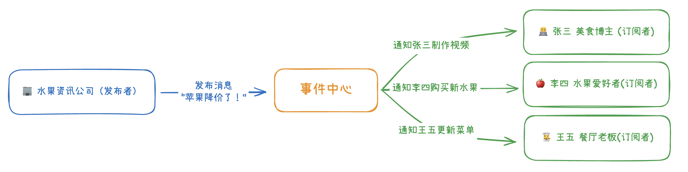
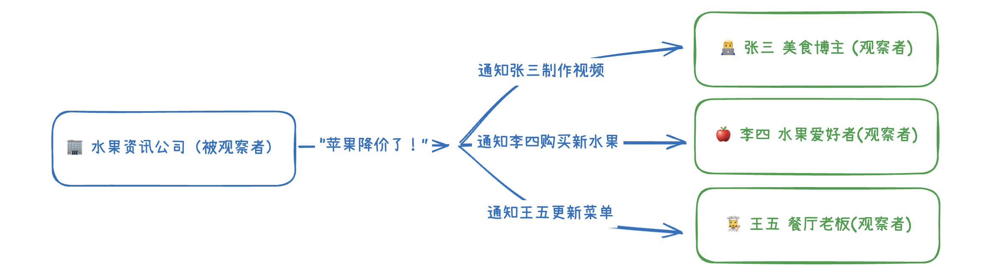

# 发布订阅模式和观察者模式傻傻分不清？一文搞懂两大设计模式

## 背景

### 为什么需要“发布订阅模式”或“观察者模式”？

想象一下这样的场景：有一家水果资讯公司，掌握着所有水果的最新行情和上市信息。每当有新的水果上市或价格变动时，这家公司都会第一时间发布消息。

现在有两个不同的人需要这些信息：

- **张三**：一名美食博主，需要根据水果资讯制作推荐视频
- **李四**：一名水果爱好者，想要第一时间买到新上市的水果

**传统代码实现的问题**

如果用传统的方式来实现这个需求，代码可能是这样的：

```javascript
// 发布最新的水果资讯
function publishFruitNews() {
  // 每次发布，张三都会整理资讯，李四都会买新水果
  integrateFruitNews();
  buyFruit();
}

// 整合水果资讯
function integrateFruitNews() {}

// 根据资讯购买最新水果
function buyFruit() {}

publishFruitNews();
```

这种写法虽然能实现功能，但存在几个严重的问题：

1. 发布者（水果资讯公司）需要直接调用订阅者（张三、李四）的具体方法。如果张三的方法名改了，发布者也要跟着改。
2. 如果以后有更多人想订阅消息，也要不断修改 `publishFruitNews`，扩展性很差。
3. `publishFruitNews` 既要负责发布消息，又要负责调用各种处理逻辑，职责混乱，代码难维护。

**我们需要一种更好的模型来解决上述问题，「发布订阅模式」和「观察者模式」就是两个典型的例子，我们将在下文为大家详细讲解。**

## 发布订阅模式

### 什么是发布订阅模式？

**在软件架构中，发布订阅是一种消息范式，主要用于“一对多”的消息**。发送者不会将消息直接发送给特定的接收者，而是提供给一个类似于“委托方”的事件中心，由事件中心将消息发送给所有订阅者。

回到我们刚才的水果资讯场景，发布订阅模式就像是一个**消息中介**，它解决了我们之前遇到的所有问题：

**核心概念**

- **发布者**（水果资讯公司）只负责发布消息，不需要知道谁在听
- **订阅者**（张三、李四）只负责订阅自己关心的消息，不需要知道消息是谁发的
- **事件中心**（中介）负责管理所有的发布和订阅关系



**具体的工作流程：**

1. 张三和李四先到事件中心"登记"，说"我要订阅水果资讯"
2. 水果资讯公司发布消息时，只需要告诉事件中心"有新资讯了"
3. 事件中心自动通知所有订阅了水果资讯的人
4. 张三收到消息后制作视频，李四收到消息后去买水果

### 实现一个基础版的发布订阅

现在我们来用代码实现这个"事件中心"。一个简单的发布订阅模式需要两个核心功能：

1. **订阅功能**（`on` 方法）：让张三、李四可以"登记"自己要接收消息
2. **发布功能**（`emit` 方法）：让水果资讯公司可以发布消息

我们用一个数组来存储所有的订阅者，当有消息发布时，就通知数组里的每一个订阅者：

```javascript
// 创建事件中心
const eventBus = {
  events: [], // 存储所有订阅者的数组

  // 订阅方法：添加订阅者
  on: (callback) => {
    eventBus.events.push(callback);
  },

  // 发布方法：通知所有订阅者
  emit: (data) => {
    eventBus.events.forEach((callback) => callback(data));
  },
};

// 张三订阅消息
eventBus.on((data) => console.log("张三收到消息并进行操作：", data));
// 李四订阅消息
eventBus.on((data) => console.log("李四收到消息并进行操作：", data));

// 水果资讯公司发布消息
eventBus.emit("🍎 苹果降价了");
// 输出：张三收到消息并进行操作：🍎 苹果降价了
// 输出：李四收到消息并进行操作：🍎 苹果降价了
```

这样，发布者只需要调用 `emit` 发布消息，事件中心会自动通知所有订阅者，完全解决了之前的耦合问题！

### 支持订阅时指定消息类型

现实中，张三可能只关心苹果的资讯，李四只关心香蕉的资讯。如果每次发布任何水果消息都通知所有人，就会造成信息干扰。

我们需要让订阅者可以**指定自己感兴趣的消息类型**。这时候就不能用简单的数组了，而是要用对象来分类存储不同类型的订阅者：

```javascript
const eventBus = {
  events: {}, // 用对象存储不同类型的订阅者

  // 订阅指定类型的消息
  on: (eventName, callback) => {
    // 如果这个类型还没有订阅者，先创建一个空数组
    if (!eventBus.events[eventName]) {
      eventBus.events[eventName] = [];
    }
    eventBus.events[eventName].push(callback);
  },

  // 发布指定类型的消息
  emit: (eventName, data) => {
    // 只通知订阅了这个类型的人
    if (eventBus.events[eventName]) {
      eventBus.events[eventName].forEach((callback) => callback(data));
    }
  },
};

// 张三只订阅苹果资讯
eventBus.on("apple", (data) => console.log("张三收到苹果消息：", data));
// 李四只订阅香蕉资讯
eventBus.on("banana", (data) => console.log("李四收到香蕉消息：", data));

// 发布不同类型的消息
eventBus.emit("apple", "🍎 苹果降价了"); // 输出：张三收到苹果消息：🍎 苹果降价了
eventBus.emit("banana", "🍌 香蕉上新了"); // 输出：李四收到香蕉消息：🍌 香蕉上新了
```

### 支持 once 方法和 off 方法

在实际使用中，我们可能会遇到两种新的需求：

1. **一次性订阅**：张三可能只想收到一次苹果降价的消息，收到后就不再关注了
2. **取消订阅**：李四可能某天不想再收到香蕉消息了，需要取消订阅

为了支持这些功能，我们需要给事件中心增加两个新方法：

```javascript
const eventBus = {
  events: {},

  // 订阅消息
  on: (eventName, callback) => {
    if (!eventBus.events[eventName]) {
      eventBus.events[eventName] = [];
    }
    eventBus.events[eventName].push(callback);
  },

  // 取消订阅
  off: (eventName, callback) => {
    if (eventBus.events[eventName]) {
      eventBus.events[eventName] = eventBus.events[eventName].filter(
        (item) => item !== callback
      );
    }
  },

  // 一次性订阅：只接收一次消息就自动取消
  once: (eventName, callback) => {
    const onceCallback = (data) => {
      callback(data);
      eventBus.off(eventName, onceCallback); // 立即取消订阅
    };
    eventBus.on(eventName, onceCallback);
  },

  // 发布消息
  emit: (eventName, data) => {
    if (eventBus.events[eventName]) {
      eventBus.events[eventName].forEach((callback) => callback(data));
    }
  },
};

// 张三只想收到一次苹果降价消息
eventBus.once("apple", (data) => console.log("张三收到一次性消息：", data));

// 李四正常订阅香蕉消息
const lisiCallback = (data) => console.log("李四收到香蕉消息：", data);
eventBus.on("banana", lisiCallback);

// 发布消息
eventBus.emit("apple", "🍎 苹果降价了"); // 输出：张三收到一次性消息：🍎 苹果降价了
eventBus.emit("apple", "🍎 苹果又降价了"); // 张三不会再收到消息

eventBus.emit("banana", "🍌 香蕉上新了"); // 输出：李四收到香蕉消息：🍌 香蕉上新了

// 李四决定取消订阅
eventBus.off("banana", lisiCallback);
eventBus.emit("banana", "🍌 香蕉又上新了"); // 李四不会再收到消息
```

## 观察者模式

### 什么是观察者模式？

观察者模式是一种行为型设计模式，它定义了一种一对多的依赖关系，当一个对象的状态发生改变时，其所有依赖者都会收到通知并自动更新。


上图是《深入设计模式》这本书中有关“观察者模式”的插图，可以从这张插图中明显观察到它与之前提到的“发布订阅模式”的之间的不同  —— **观察者模式没有“中介”，所有的观察者都是直接观察被观察者**。还是用我们的水果资讯场景来理解：

**核心概念：**

- **被观察者**（水果资讯公司）：维护一个观察者列表，状态改变时直接通知所有观察者
- **观察者**（张三、李四）：实现更新方法，等待被观察者的直接通知



**两种模式的区别：**

- **发布订阅模式**：张三、李四通过"事件中心"这个中介来接收水果资讯公司的消息
- **观察者模式**：张三、李四直接"关注"水果资讯公司，公司有消息时直接通知他们

### 实现简单的观察者模式

现在我们来用代码实现观察者模式。与发布订阅模式不同，这里不需要事件中心，而是让被观察者直接管理观察者列表。

由于这种观察者模式不再有所谓的“订阅”操作，也就是说我需要统一每个观察者执行操作的方法名，以便于被观察者在发生变化时直接调用这些观察者的同名方法。在这里我选择面向对象的形式来进行实现：

```javascript
// 观察者类
class Observer {
  constructor(name) {
    this.name = name;
  }
  // 接收通知的方法
  update(data) {
    console.log(`${this.name}收到消息：`, data);
  }
}

// 被观察者类
class Subject {
  constructor() {
    this.observers = []; // 直接维护观察者列表
  }
  // 添加观察者
  addObserver(observer) {
    this.observers.push(observer);
  }
  // 移除观察者
  removeObserver(observer) {
    this.observers = this.observers.filter((obs) => obs !== observer);
  }
  // 通知所有观察者
  notify(data) {
    this.observers.forEach((observer) => observer.update(data));
  }
}

// 创建被观察者和观察者
const fruitCompany = new Subject(); // 水果资讯公司
const zhangSan = new Observer("张三"); // 张三
const liSi = new Observer("李四"); // 李四

// 张三、李四关注水果资讯公司
fruitCompany.addObserver(zhangSan);
fruitCompany.addObserver(liSi);

// 水果资讯公司发布消息
fruitCompany.notify("🍎 苹果降价了");
// 输出：张三收到消息： 🍎 苹果降价了
// 输出：李四收到消息： 🍎 苹果降价了

// 李四不想再关注了
fruitCompany.removeObserver(liSi);
fruitCompany.notify("🍌 香蕉上新了"); // 输出：张三收到消息： 🍌 香蕉上新了
```

在上述代码中，我们维护了 **Observer 类**来代表观察者，每个观察者都有一个 `update` 方法来接收通知。同时维护了 **Subject 类**代表被观察者，维护一个观察者列表，提供添加、移除和通知观察者的方法。**被观察者直接调用观察者的 `update` 方法，中间没有中介。**

### 让每个观察者都能维护自己的更新操作

在上面的示例中，张三和李四收到消息后都只是简单地打印消息，这是因为我们提前定义好了 Observer 观察者类，通过这个类去实例化出来的对象全部都是按照同样的模板生成的。

现实中，张三收到消息后要制作短视频，李四收到消息后要去买水果，他们的操作是不同的。我们可以把 Observer 作为基类，通过**继承**的方式，让每个观察者都有自己独特的处理方式：

```javascript
// 基础观察者类
class Observer {
  constructor(name) {
    this.name = name;
  }
  // 默认的更新方法，子类可以重写
  update(data) {
    console.log(`${this.name}收到消息：`, data);
  }
}

// 被观察者类
class Subject {
  constructor() {
    this.observers = [];
  }

  addObserver(observer) {
    this.observers.push(observer);
  }

  notify(data) {
    this.observers.forEach((observer) => observer.update(data));
  }
}

// 张三类：继承Observer，有自己的处理方式
class ZhangSan extends Observer {
  constructor() {
    super("张三"); // 调用父类构造函数
  }
  // 重写update方法，实现自己的处理逻辑
  update(data) {
    console.log(`${this.name}收到消息，开始制作短视频：`, data);
    this.makeVideo(data);
  }
  makeVideo(data) {
    console.log("📹 张三正在拍摄水果推荐视频...");
  }
}

// 李四类：继承Observer，有自己的处理方式
class LiSi extends Observer {
  constructor() {
    super("李四");
  }
  // 重写update方法，实现自己的处理逻辑
  update(data) {
    console.log(`${this.name}收到消息，准备购买水果：`, data);
    this.buyFruit(data);
  }
  buyFruit(data) {
    console.log("🛒 李四正在下单购买水果...");
  }
}

// 王五类：继承Observer，使用默认处理方式
class WangWu extends Observer {
  constructor() {
    super("王五");
  }
}

// 使用示例
const fruitCompany = new Subject(); // 水果资讯公司
const zhangSan = new ZhangSan(); // 张三
const liSi = new LiSi(); // 李四
const wangWu = new WangWu(); // 王五

// 添加观察者
fruitCompany.addObserver(zhangSan);
fruitCompany.addObserver(liSi);
fruitCompany.addObserver(wangWu);

// 发布消息
fruitCompany.notify("🍎 苹果降价了");
// 输出：
// 张三收到消息，开始制作短视频： 🍎 苹果降价了
// 📹 张三正在拍摄水果推荐视频...
// 李四收到消息，准备购买水果： 🍎 苹果降价了
// 🛒 李四正在下单购买水果...
// 王五收到消息： 🍎 苹果降价了
```

## 总结

通过本文的学习，我们了解了两种重要的设计模式：

**发布订阅模式**：通过事件中心作为中介，实现发布者和订阅者的完全解耦，支持消息分类、一次性订阅和取消订阅等功能，适合复杂的消息通信场景。

**观察者模式**：被观察者直接管理观察者列表，实现更直接的通知机制，虽然耦合度较高，但结构简单，适合简单的一对多通知场景。

两种模式都解决了传统代码中的耦合问题，让我们的代码更加灵活、可维护。在实际开发中，可以根据具体需求选择合适的模式来优化代码结构。
