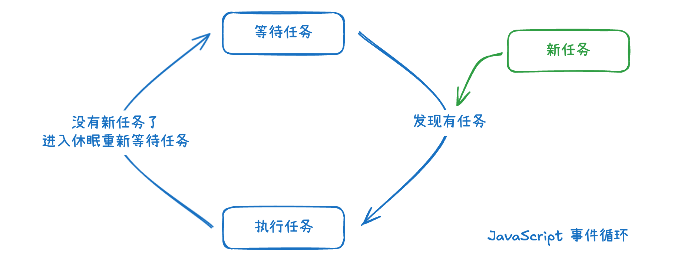
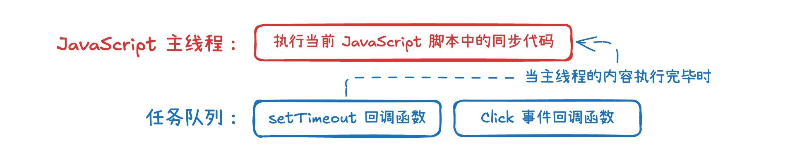
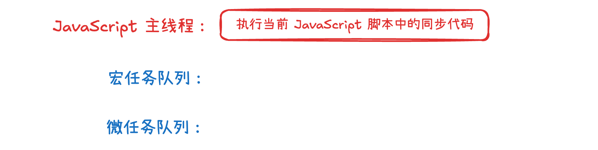
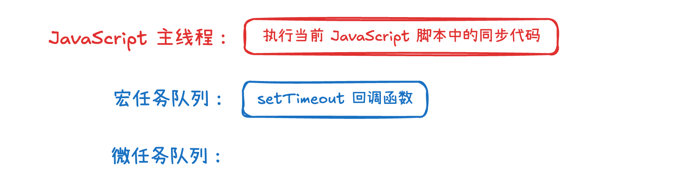
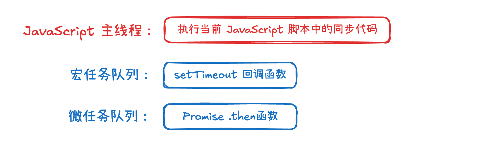
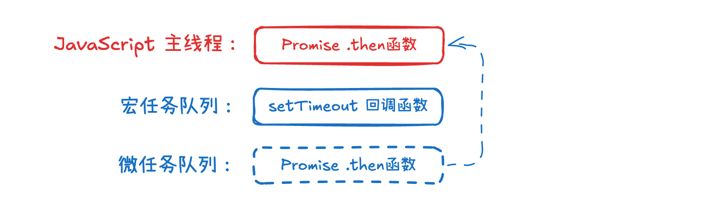
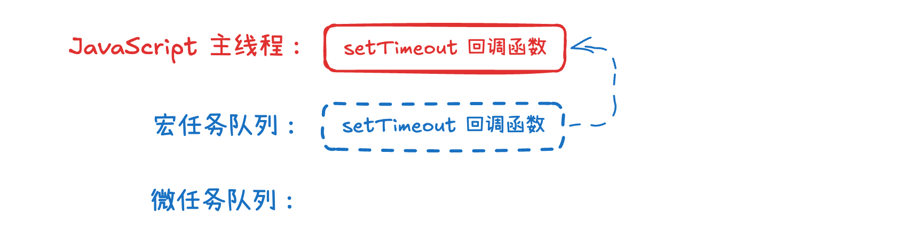
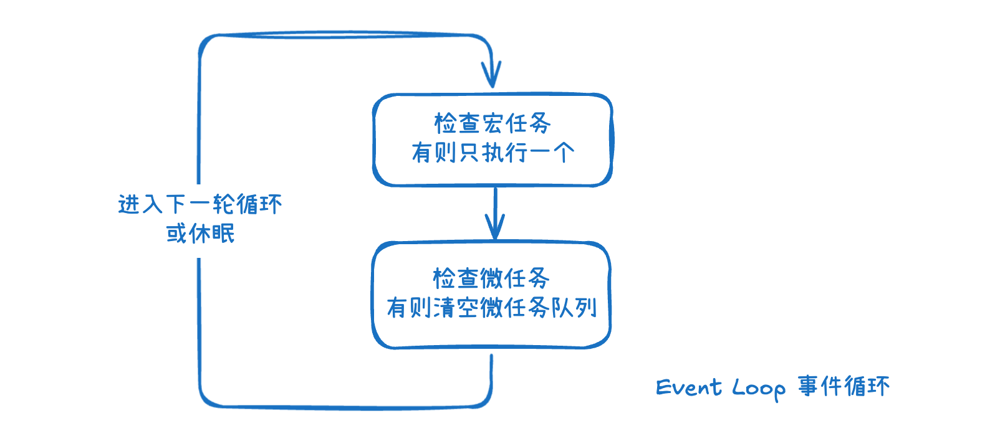

# 深入理解 JavaScript 事件循环：从原理到手写调度器

## JavaScript 事件循环机制

在 JavaScript 环境中，事件循环（Event Loop） 是协调同步任务和异步任务的 **核心机制**。

### 为什么需要事件循环？

**JavaScript 最初设计为单线程语言，意味着它只有一个线程（后文我们称为主线程），一次只能执行一个任务**。在实际页面上往往会有多个任务，例如：网络请求操作、界面绘制操作等等。如果所有操作都同步执行，会导致以下问题：

- 耗时长的复杂任务阻塞界面绘制，会导致用户无法对网页产生交互。
- 异步任务会直接阻塞主线程，导致在异步操作过程中，所以操作都必须暂停

事件循环就是**通过一些任务队列来管理各式各样的任务**，保证代码有序执行，同时避免阻塞主线程。

### 什么是事件循环？

**事件循环的本质就是一个任务调度器**，总是在「**等待任务**」、「**执行任务**」、「**进入休眠重新等待任务**」这些状态之间反复流转。



例如在执行一段 JavaScript 脚本时，可能一段时间后 setTimeout 到期了，需要执行其中的回调函数；用户可能点击了一个按钮，需要执行绑定的事件处理函数……

如下图所示。在实际处理流程上，在 setTimeout 到期时或按钮触发时，需要执行的函数都会被**依次推入到「任务队列」中**，而队列中任务的执行都需要等待「**当前主线程上的任务（执行当前 JavaScript 脚本中的同步代码）**」结束后，由**事件循环机制依次调度到主线程上执行**。



### 宏任务与微任务

在现实生活中，当有多件事情需要处理时，往往需要分清”轻重缓急“，重要紧急的事情优先处理，其他的事情可以稍后处理，在 JavaScript 调度任务时也遵循着这样的原理。

我们通常将 任务 分为了「**宏任务**（高优先级）」和「**微任务**（低优先级）」。对应的，任务队列 也就分为了「**宏任务队列**」和「**微任务队列**」。

- **宏任务** 是 JavaScript 中 **优先级较低** 的任务，且在每个事件循环中仅会执行一个宏任务。
  **通常宏任务包括**：script 脚本执行、用户事件触发、setTimeout / setInterval 定时器……
- **微任务** 是 JavaScript 中 **优先级较高** 的任务，会在「**当前主线程的同步代码执行完毕后**」**立即执行**，且会 **一次性清空整个微任务队列** 后再继续事件循环。
  **常见的微任务包括**：Promise.then / catch / finally 的回调函数……

---

🌰 举个例子，假设有这样的一段代码。你能根据上面所提到的知识推断出具体的打印顺序吗？

```javascript
console.log("Hello 1");
setTimeout(() => {
  console.log("setTimeout 1");
}, 0);
console.log("Hello 2");
new Promise((resolve) => {
  console.log("Promise 1");
  resolve();
}).then(() => {
  console.log("Promise 2");
});
console.log("Hello 3");
```

我们开始从事件循环的角度上来分析上述代码：

**首先**，当浏览器在加载到这段 JavaScript 脚本时，**把这段脚本放到「宏任务队列」中**，此时并没有其他任务排队，所以开始将这段代码放到主线程上执行。**此时「宏任务队列」和「微任务队列」中均没有其他任务。**



同步代码执行到第一行时，直接打印出 `Hello 1`

同步代码执行到 setTimeout 时，**向「宏任务队列」推送一个任务，在 0 秒后 执行回调函数**，但是**由于此时主线程被占用**，所以**即使到了 0 秒后 这个时间点也需要在队列中排队等待**。



同步代码执行到第五行时，直接打印出 `Hello 2`

当执行到 `new Promise` 时，**Promise 内部执行的代码也被算作为同步代码立即执行**，所以直接打印出 `Promise 1` ，随即 `resolve()`。此时，**向「微任务队列」推送一个任务**，当 Promise 返回结果时，执行回调函数。**由于此时主线程被占用，所以即便已经返回了结果，也需要在队列中排队等待**。



同步代码执行到最后一行时，直接打印出 `Hello 3`

此时，同步代码已经全部执行完毕。**事件循环机制会检查微任务队列中是否有任务，如果有，则会全部执行完**。由于此时微任务队列中存在 Promise 的 .then 函数，所以放到主线程执行该函数，打印出 `Promise 2` 。



微任务队列清空后，**本次事件循环结束**，开启下一个事件循环（每个事件循环仅执行一个宏任务）。**事件循环机制发现宏任务队列中仍然存在任务，所以选取第一个宏任务放到主线程执行**。第一个宏任务是 setTimeout 回调函数，故执行该函数，打印出 `setTimeout 1` 。



### 结合宏任务与微任务看事件循环

实际上，「宏任务」与「微任务」的优先级关系，只是我们自己评定的。

在**单次事件循环中，永远都是先检查「宏任务队列」再检查「微任务队列」**。 Node.js 官方文档中解释："Microtasks are executed after every individual Macrotask in the event loop"，意思是 **微任务仅在事件循环中每个单独的宏任务之后执行**。

所以一次事件循环的真实执行流程如下：

1. 判断是否有宏任务，如果**有则执行一个宏任务**。
2. 判断是否有微任务，如果**有则清空微任务队列**，若微任务在执行过程中产生了新的微任务，则继续执行微任务，直到所有微任务均被执行。
3. 如果前两步都没有执行任务，则进入休眠状态（等待任务到来），否则进入下一轮循环。



## 尝试手写一个事件循环调度器

在上文中，我们已经详细的介绍了每一次事件循环中的任务调度流程，所以我们只需要按照上面提到的流程转换为代码实现即可。

我们在下面的代码实例中，尝试把 runScript 函数模拟为实际 JavaScript 脚本中的同步代码，最终可以得到预期的输出结果。

```javascript
class TaskManager {
  constructor() {
    this.microTasks = [];
    this.macroTasks = [];
    this.isRunning = false;
  }
  pushMicro(fn) {
    // 新增微任务会开启事件循环（因为有可能在休眠状态）
    this.microTasks.push(fn);
    this.start();
  }
  pushMacro(fn) {
    // 新增宏任务会开启事件循环（因为有可能在休眠状态）
    this.macroTasks.push(fn);
    this.start();
  }
  runMicro() {
    // 微任务的执行需要清空微任务队列
    while (this.microTasks.length > 0) {
      this.microTasks.shift()();
    }
  }
  runMacro() {
    // 宏任务的执行仅执行一个宏任务
    if (this.macroTasks.length > 0) {
      this.macroTasks.shift()();
    } else {
      // 如果没有宏任务，则将isRunning设置为false，让事件循环进入休眠状态（但是本次循环还会进行，所以微任务会被执行）
      this.isRunning = false;
    }
  }
  start() {
    // 唤醒事件循环
    if (this.isRunning) return;
    this.isRunning = true;
    while (this.isRunning) {
      // 执行宏任务
      this.runMacro();
      // 执行完宏任务后，清理宏任务产生的微任务，确保微任务队列清空
      this.runMicro();
    }
  }
}

const taskManager = new TaskManager();

// 添加微任务
const pushMicro = (fn) => taskManager.pushMicro(fn);
// 添加宏任务
const pushMacro = (fn) => taskManager.pushMacro(fn);

const runScript = () => {
  console.log("a");
  pushMicro(() => {
    console.log("b");
    pushMicro(() => {
      console.log("c");
    });
    pushMacro(() => {
      console.log("d");
    });
  });
  pushMacro(() => {
    console.log("e");
  });
  console.log("f");
};

pushMacro(runScript); // 输出：a, f, b, c, e, d
```

## 总结

JavaScript 事件循环是单线程语言处理异步任务的核心机制，通过宏任务和微任务的优先级调度，确保代码有序执行而不阻塞主线程。理解事件循环的工作原理对于编写高效的异步代码至关重要，掌握其执行顺序能够帮助我们更好地调试和优化 JavaScript 应用。
