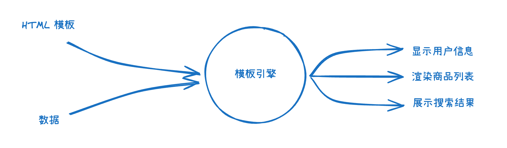
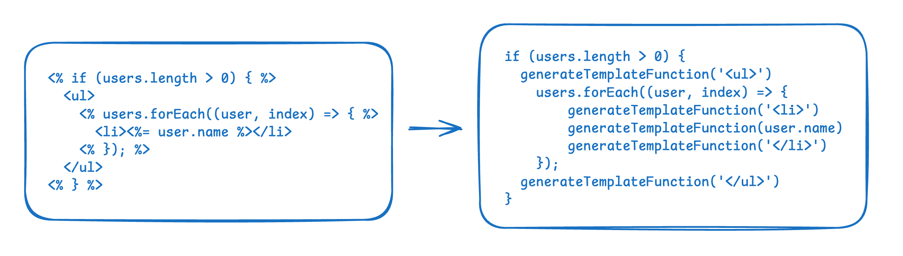

# 从零实现字符串模板引擎：从 正则解析 到 AST 思路解析 的进阶之路

## 什么是模板引擎？

### 背景

在前端开发过程中，**「动态内容渲染」是非常常见的需求**。比如显示用户信息、渲染商品列表、展示搜索结果等场景。这些内容往往**需要将 JavaScript 中的数据和 HTML 结构结合起来**。

传统的做法是手动拼接 HTML 字符串。开发者需要将 HTML 标签、属性和数据用加号连接起来，然后插入到页面中。

```javascript
const user = { name: "Alice", age: 25 };
const htmlList = [];
htmlList.push('<div class="profile">');
htmlList.push("<h2>" + user.name + "</h2>");
htmlList.push("<p>Age: " + user.age + "</p>");
htmlList.push("</div>");
const html = htmlList.join("");
document.body.appendChild(html);
```

这种方式存在明显的问题：**代码中会存在大量的引号、加号和换行符，看起来非常混乱，特别是当 HTML 结构复杂时，很容易忘记闭合标签或者拼接错误**。

### 模板引擎

模板引擎是一种用于动态生成 HTML 的工具，通过模板语法将静态模板与动态数据结合，最终输出渲染后的 DOM 结构。



模板引擎分为很多种，从工作方式上可以分为：**字符串模板引擎**（直接拼接字符串生成 HTML）、**虚拟 DOM 模板引擎**（先生成虚拟 DOM，再更新真实 DOM）等……

现代开发技术中有很多已经实现好的模板引擎：

| 引擎  | 语法风格 | 从工作方式上分类  |
| ----- | -------- | ----------------- |
| `EJS` | `<% %>`  | 字符串模板引擎    |
| `JSX` | `{ }`    | 虚拟 DOM 模板引擎 |

以 EJS 字符串模板引擎为例：**可以通过 `<%= %>` 结合 JavaScript 表达式来渲染动态内容**。

通过 EJS 提供的 render 方法，可以将模板和对应的数据上下文结合，生成最终的 HTML 字符串。

```javascript
let ejs = require("ejs"),
  people = ["geddy", "neil", "alex"],
  html = ejs.render('<h1><%= people.join(", "); %></h1>', { people: people });
console.log(html); // <h1>geddy, neil, alex</h1>
```

在上面的例子中，`<%= people.join(", "); %>` 会被替换为 `"geddy, neil, alex"`。

通常情况下，复杂的模板引擎还会支持条件渲染、循环渲染等高阶功能。**EJS 提供了 `<%  %>` 语法结合 `if`、`for` 等语句来实现上面提到的这些高级功能**。

```javascript
let ejs = require("ejs"),
  people = ["geddy", "neil", "alex"],
  html = ejs.render(
    `
    <% if (people.length > 0) { %>
      <ul>
        <% people.forEach(person => { %>
          <li><%= person %></li>
        <% }); %>
      </ul>
    <% } %>
  `,
    { people }
  );
console.log(html); // <ul><li>geddy</li><li>neil</li><li>alex</li></ul>
```

## 实现一个简单的字符串模板引擎

### 原理

首先我们要搞清楚字符串模板引擎的实现原理，通常分为三个步骤：


1. **解析**：解析模板字符串，提取出模板中的静态内容和动态内容。解析的过程可以采用「正则表达式」的方式或者是「AST 抽象语法树」的方式。
2. **生成**：结合数据上下文，执行模板字符串中的 JavaScript 表达式，生成最终的 HTML 字符串。
3. **渲染**：将生成的 HTML 字符串插入到页面中。

### 方案一：简单粗暴的正则表达式替换

在刚开始，我尝试过**直接使用正则表达式来解析模板字符串**，替换模板中的动态内容。

通过 new Function 函数，可以执行模板字符串中的 JavaScript 表达式，并返回结果。

```javascript
const users = [
  { name: "John", age: 20 },
  { name: "Jane", age: 21 },
];

const str = `
  <div>
    <%=   users[0].name   %>
  </div>
`;

const transformSimpleExpression = (str, data) => {
  const match = str.match(/<%=(.*?)%>/); // 匹配 <%= 和 %> 之间的内容（允许为空）
  const index = match["index"];
  const content = match[1];
  const result = new Function(...Object.keys(data), "return " + content)(
    ...Object.values(data)
  );
  return str.slice(0, index) + result + str.slice(index + match[0].length);
};

console.log(transformSimpleExpression(str, { users }));
// 输出：<div>John</div>
```

这样的暴力手段虽然可以实现，但是存在很多问题：

- **无法处理复杂的模板语法**，无法带入这些语法的上下文，例如循环语法中的 `index` 变量。
- match 语法在处理多个动态内容时，**通过计算索引值来替换内容非常的复杂**。

### 方案二：使用 replace 语法优化替换行为

实际上，方案一中的代码只能替换一个简单的表达式，我们可以使用 replace 语法直接简化上面的代码，并支持多个动态内容。

```javascript
const users = [
  { name: "John", age: 20 },
  { name: "Jane", age: 21 },
];

const str = `
  <div>
    <%=   users[0].name   %>
  </div>
`;

const transformSimpleExpression2 = () => {
  let result = "`" + str + "`";
  result = result.replace(/<%=(.*?)%>/g, (_, p1) => {
    return "` + " + p1 + " + `";
  });
  return new Function(...Object.keys(data), "return " + result)(
    ...Object.values(data)
  );
};

console.log(transformSimpleExpression2(str, { users }));
// 输出：<div>John</div>
```

上面的代码中，无法处理多个动态内容的内容解决了，但是仍然没有办法处理高阶语句。**高阶语句不能像简单语句一样无脑添加「加号」**，如果我们用处理简单表达式的方式处理高阶语句，会发现这些语句无法执行，**我们必须以函数式的思想来处理高阶语句**。

### 方案三：使用函数式思想处理高阶语句

实际上，方案二的整体思路没什么问题，这种静态语句和动态语句是一定要使用相加的方式进行拼接的，但是**高阶语句不能像简单语句一样无脑添加「加号」**。

**所以能否把「相加」这个行为脱离于高阶语句之外，让高阶语句只负责执行，而相加这个行为由一个函数来执行呢？**

```javascript
const users = [
  { name: "John", age: 20 },
  { name: "Jane", age: 21 },
];

const str = `
    <% if (users.length > 0) { %>
      <ul>
        <% users.forEach((user, index) => { %>
          <li><%= user.name %></li>
        <% }); %>
      </ul>
    <% } %>
`;

const template = "";
const generateTemplateFunction = (str) => {
  template += str;
};

const parse = (str, data) => {
  let result = "generateTemplateFunction(`" + str + "`);";
  result = result
    .replace(/<%=(.*?)%>/g, (_, p1) => {
      return (
        "`); generateTemplateFunction(" + p1 + "); generateTemplateFunction(`"
      );
    })
    .replace(/<%(.*?)%>/g, (_, p1) => {
      return "`);" + p1 + "generateTemplateFunction(`";
    });
  new Function(...Object.keys(data), "generateTemplateFunction", result)(
    ...Object.values(data),
    generateTemplateFunction
  );
  return result;
};

parse(str, { users });
console.log(template);
// 输出：<ul><li>John</li><li>Jane</li></ul>
```

在上面的代码中，我们通过 `generateTemplateFunction` 函数来统一进行相加操作，通过 `parse` 函数来解析模板字符串，并执行模板字符串中的 JavaScript 表达式。解析并转换后的的模板字符串为如下：



### 方案四：使用 AST 抽象语法树思想处理解析环节

解析的环节，我们使用正则表达式来处理，但是正则表达式处理起来非常的复杂，并且后续的语法拓展性也不强，**所以我们可以使用 AST 抽象语法树的思想来处理解析环节**。

```javascript
const users = [
  { name: "John", age: 20 },
  { name: "Jane", age: 21 },
];

const str = `
    <% if (users.length > 0) { %>
      <ul>
        <% users.forEach((user, index) => { %>
          <li><%= user.name %></li>
        <% }); %>
      </ul>
    <% } %>
`;

const template = "";
const generateTemplateFunction = (str) => {
  template += str;
};

// 先把标签列表生成出来
const generateTagList = (html) => {
  const tagList = [];
  let startIndex = -1;
  for (let i = 0; i < html.length; i++) {
    const char = html[i];
    if (char === "<") {
      startIndex !== i - 1 && tagList.push(html.slice(startIndex + 1, i)); // 如果startIndex和i-1相等
      startIndex = i;
    } else if (char === ">") {
      tagList.push(html.slice(startIndex, i + 1));
      startIndex = i;
    }
  }
  return tagList;
};

// 把标签列表转换成树结构
const transformNodeTree = (html) => {
  const tagList = generateTagList(html);
  const nodeTree = [];
  for (let i = 0; i < tagList.length; i++) {
    const tag = tagList[i];
    if (tag.startsWith("<%=")) {
      nodeTree.push({
        type: "SimpleExpression",
        tag,
        content: tag.slice(3, -2),
      });
    } else if (tag.startsWith("<%")) {
      nodeTree.push({
        type: "BlockExpression",
        tag,
        content: tag.slice(2, -2),
      });
    } else if (tag.startsWith("</")) {
      nodeTree.push({
        type: "Element",
        elementType: "end",
        tag,
        content: tag.slice(1, -1),
      });
    } else if (tag.startsWith("<")) {
      nodeTree.push({
        type: "Element",
        elementType: "start",
        tag,
        content: tag.slice(1, -1),
      });
    } else {
      nodeTree.push({
        type: "Text",
        tag,
        content: tag.slice(1, -1),
      });
    }
  }
  return nodeTree;
};

// 还是和之前一样生成个模板然后给newFunction执行
const generateTemplate = (nodeTree) => {
  let template = "";
  for (let i = 0; i < nodeTree.length; i++) {
    const node = nodeTree[i];
    if (node.type === "SimpleExpression") {
      template += `transformSimpleExpression3(${node.content});`;
    } else if (node.type === "BlockExpression") {
      template += `${node.content}`;
    } else if (node.type === "Element") {
      template += `transformSimpleExpression3("${node.tag}");`;
    } else if (node.type === "Text") {
      template += `transformSimpleExpression3("${node.content}");`;
    }
  }
  return template;
};

function render2(html, data) {
  const nodeTree = transformNodeTree(html);
  const template = generateTemplate(nodeTree);
  new Function(...Object.keys(data), "generateTemplateFunction", template)(
    ...Object.values(data),
    generateTemplateFunction
  );
  return result;
}

render2(str, { users });
console.log(template);
// 输出：<ul><li>John</li><li>Jane</li></ul>
```

在上面的代码中，我们先通过 `generateTagList` 和 `transformNodeTree` 函数**将模板字符串转换成标签节点列表**，然后通过 `generateTemplate` 函数**生成模板字符串**，最后通过 `new Function` 函数**执行模板字符串**。

**整体的生成逻辑和方案三是一样的，只不过把解析的方法从正则表达式替换变成了 AST 抽象语法树思想。**

### 解析环节中的两种方式对比

在上面的代码中，我们使用了两种不同的方式来处理解析环节，一种是正则表达式替换，一种是 AST 抽象语法树思想。

- **正则表达式替换**：该方法思路比较简单，在**对简单模板语法上处理相对来说比较高效**，但是对于复杂模板语法来说处理起来非常的复杂，并且**后续的语法拓展性也不强**，依靠正则表达式来解析模板也未必完全可靠。
- **AST 抽象语法树思想**：该方法思路比较复杂，在对简单模板语法上有点“杀鸡用牛刀”的感觉，但是**对于复杂的模板实际处理起来比较简单，同时后续基于解析出来的内容拓展性方面非常强**。

现有技术方案中，**EJS 模板引擎** 和 **Handlebars 模板引擎** 都使用了 AST 抽象语法树思想来处理解析环节。

## 总结

字符串模板引擎通过解析模板语法、结合数据上下文、生成最终 HTML 的方式，解决了传统字符串拼接的可读性和维护性问题。从简单的正则表达式替换到复杂的 AST 解析，不同的实现方案各有优劣，理解其核心原理有助于我们更好地使用现代模板引擎，也能为自定义模板系统提供思路。
