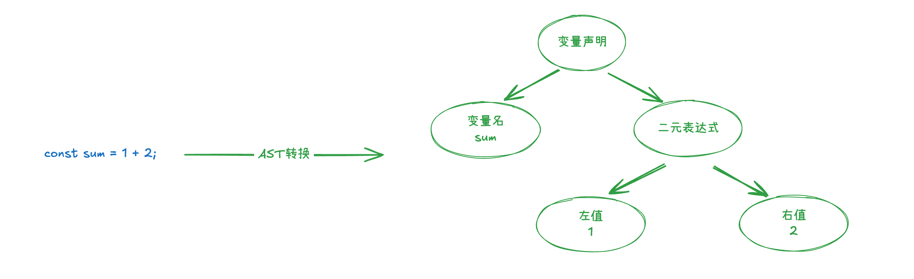
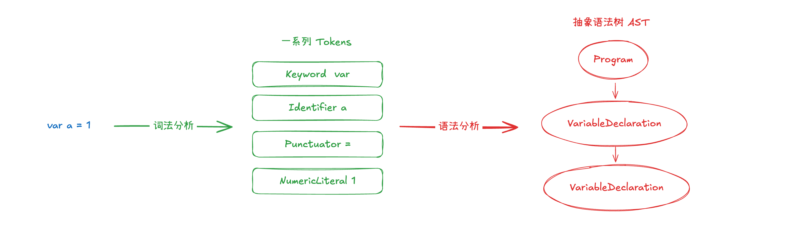
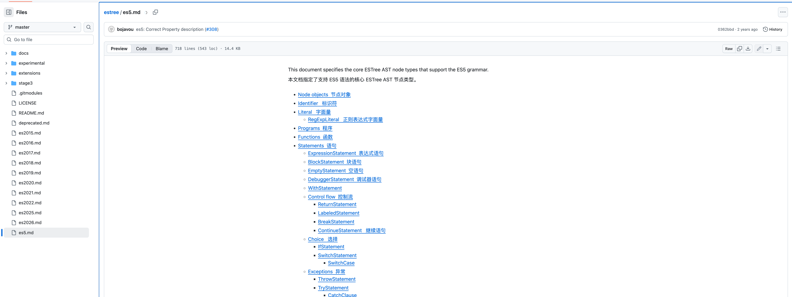
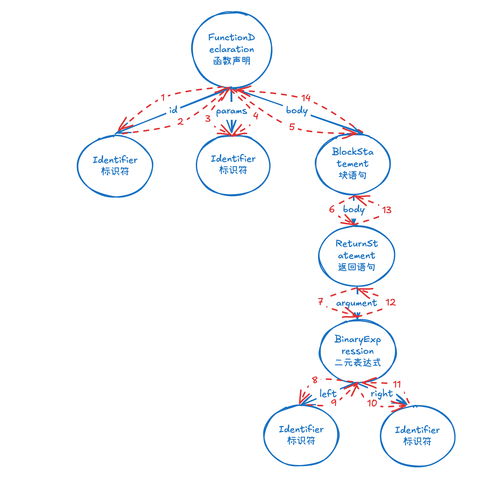

# 把代码变成“可改的树”：一文读懂前端 AST 的原理与实战

## 前言：什么是 AST（抽象语法树）？

在现代前端开发中，AST（Abstract Syntax Tree，抽象语法树）指的是“用树来表达一段代码的语法结构”。通俗理解：把代码先读懂、拆解成一个个语法“节点”，再把这些节点按层级连成一棵树，后续工具就能“对树动手术”。

AST 的用途非常广，是许多工具的基础：

- Babel：把新语法转成旧语法，或做各类代码改写
- ESLint：根据规则检查/修复代码问题
- Prettier：根据统一风格重新排版代码
- 以及更多编译、打包、重构、分析类工具

🌰 举一个特别形象的例子：小时候学英语的时候，老师经常会告诉我们在阅读长难句的时候，需要先找到主谓宾，然后再去理解句子中的其他成分。

在代码的世界里，解析 AST 就有点像分析句子的“主谓宾定状补”：先理清主干再看细节。有了 AST，其他前端工具能准确理解代码结构，从而实现重构、优化、自动修复，甚至生成新代码。

例如这段代码：

```js
const sum = 1 + 2;
```

AST（简化后）会描述出：

- VariableDeclaration（这是一个变量声明）
  - Identifier: sum（定义的变量名是 sum）
  - BinaryExpression: +（赋值的内容是一个二元表达式）
    - Literal: 1（表达式的左值）
    - Literal: 2（表达式的右值）



## Parse：解析代码生成 AST（抽象语法树）

实际上，我们编写的代码都是以字符串的形式存储在文件中的，而我们要想让计算机理解这些代码，就需要将这些代码转换成计算机能够理解的数据结构，这个过程就是解析代码生成 AST（抽象语法树）。

从字符串到解析出抽象语法树，中间会经历两个步骤：词法分析（Lexical Analysis）和语法分析（Syntax Analysis）。



### 词法分析（Lexical Analysis）

词法分析（Lexical Analysis）是编译器的第一步，它把源代码从“字符流”切分成有意义的最小单元：Token（记号）。

简单理解：

- 把连续的字符切成有意义的小块，这些小块就叫 Token。
- 每个 Token 通常包含：`type`（类型，如 Identifier 标识符、Punctuator 符号等）、`value`（字面值）、以及位置信息（`start`/`end` 或 `loc`）。
- 这一阶段只做“切词”，不建立层级结构（所以不知道谁包含谁）。

以简单的 n \* n 代码举例，最终会形成如下 token 列表：

```js
[
  { type: { ... }, value: "n", start: 0, end: 1, loc: { ... } },
  { type: { ... }, value: "*", start: 2, end: 3, loc: { ... } },
  { type: { ... }, value: "n", start: 4, end: 5, loc: { ... } },
]
```

词法分析仅仅是编译的第一步，通常情况下，开发者不会直接使用词法分析的结果，因为仅仅将字符串转换成 token 还不够，我们还需要将 token 转换成抽象语法树。

### 语法分析（Syntax Analysis）

语法分析（Syntax Analysis）是编译器的第二步，它把“线性的 token 列表”组装成“有父子层级的抽象语法树（AST）”。

现代前端开发中，能够实现将源码解析为抽象语法树的工具有很多：Babel、Acorn、Espree、Esprima 等。本文将介绍如何使用 Espree 来实现将源码解析为抽象语法树。

Espree 提供了 `parse` 方法，可以传入源码与可选配置，然后返回 AST：

```js
const espree = require("espree");
const ast = espree.parse("var a = 1;");
console.log("🚀 ~ ast:", ast);
```

```js
🚀 ~ ast: Node {
  type: 'Program',
  start: 0,
  end: 10,
  body: [
    Node {
      type: 'VariableDeclaration',
      start: 0,
      end: 10,
      declarations: [
         {
          type: 'VariableDeclarator',
          start: 4,
          end: 9,
          id: Node { type: 'Identifier', start: 4, end: 5, name: 'a' },
          init: Node { type: 'Literal', start: 8, end: 9, value: 1, raw: '1' }
        }
      ],
      kind: 'var'
    }
  ],
  sourceType: 'script'
}
```

- `Program`：整段代码的“根节点”（最外层容器）。`body` 里按顺序放着每一条语句。
- `VariableDeclaration`：一条“变量声明”语句，这里的 `kind` 是 `var`（也可能是 `let` 或 `const`）。
- `declarations`：声明列表。因为 JS 允许 `var a = 1, b = 2;` 这样的多声明，所以这里是数组。
- `VariableDeclarator`：一次具体的“声明”。它有两个关键子节点：
  - `id`：被声明的变量是谁（这里是一个 `Identifier`，名字为 `a`）。
  - `init`：这个变量被赋的初始值（这里是一个 `Literal`，数值 `1`）。
- `Identifier`：标识符节点，表示变量名、函数名等（此处为 `a`）。
- `Literal`：字面量节点，表示具体的值（此处为 `1`）。
- `start/end`：在源码字符串中的起止位置（基于字符索引），有助于错误提示、高亮、代码修改定位等。
- `sourceType`：脚本类型，`script` 表示是 CommonJS 模块，`module` 表示是 ES Module。

把上面的结构“压扁”成一棵更直观的小树，可以这样理解：

```
Program
└── VariableDeclaration (kind: var)
    └── VariableDeclarator
        ├── id: Identifier (name: a)
        └── init: Literal (value: 1)
```

需要特别注意的是：**Espree 默认支持 ES5 语法**，如果需要支持 **ES6 语法**，需要传入 `ecmaVersion` 参数，指定 ES6 语法。

### ESTree 规范 与 AST 调试工具

在上文我们提到过，能够实现将源码解析为抽象语法树的工具有很多：Babel、Acorn、Espree、Esprima 等。我们转为 AST 的目的是最终要使用 AST 进行代码的转换，但是如何能确保 AST 的规范性呢？

简单来说：不同解析器如果各自定义一套“树的长相”，后续处理的工具就没法通用。为了解决“同一种语言、不同解析器产出的 **AST** 长得不一样”的问题，于是就制定了接口规范 — **ESTree**。

在上文我们使用 Espree 打印了 **AST**。可能有些同学会有这样的疑问：不清楚这些“**节点类型**”从何而来、去哪查？**ESTree** 定义了常见节点的**命名、字段和层级关系**，可参考文档：https://github.com/estree/estree/blob/master/es5.md



与此同时，我们也可以使用 **AST 调试工具** 来快速查看 **AST 结构**，比如 **AST Explorer**（[astexplorer.net](https://astexplorer.net/)）。 在实际开发中，我们会经常使用 **AST Explorer** 来查看 AST 结构，以便于我们更好地理解代码的结构。

## Traverse：AST 遍历

目前，我们已经得到了一颗 AST 树结构，但这还远远不够，我们还需要对 AST 树进行遍历，以便于我们更好地理解代码的结构，甚至是对 AST 树的特定节点进行修改。

### 遍历方式：深度优先

AST 遍历采用的是**深度优先遍历**，简单说就是：先一头扎到底，走不通了再回头看其他分支。我们用一个实际例子来理解：

```js
function square(n) {
  return n * n;
}
```

这段代码对应的 AST（简化版）长这样：

```js
{
  type: "FunctionDeclaration",
  id: {
    type: "Identifier",
    name: "square"
  },
  params: [{
    type: "Identifier",
    name: "n"
  }],
  body: {
    type: "BlockStatement",
    body: [{
      type: "ReturnStatement",
      argument: {
        type: "BinaryExpression",
        operator: "*",
        left: {
          type: "Identifier",
          name: "n"
        },
        right: {
          type: "Identifier",
          name: "n"
        }
      }
    }]
  }
}
```

### 遍历的过程

我们从最外层的 `FunctionDeclaration`（函数声明）开始，它有三个重要属性：`id`（函数名）、`params`（参数）、`body`（函数体）。然后就像剥洋葱一样，一层层往里走。下图清晰展示了 AST 结构与遍历的过程：



**首先看 id 属性—函数名**：`id` 是一个 `Identifier` 节点，记录着函数名叫 `square`。这个节点没有子节点了，所以看完就继续往下。

**接着看 params 属性—参数**：`params` 是个数组，里面有一个 `Identifier` 节点，代表参数 `n`。

**然后进入 body —函数体**：`body` 是个 `BlockStatement`（块语句节点），也就是 `{}` 包裹的部分。它自己也有个 `body` 属性，这个属性下装着函数体内的语句。

**深入到 BlockStatement 的 body 属性**：数组里有个 `ReturnStatement` 节点，它的 `argument`（返回值）指向一个 `BinaryExpression`（二元表达式节点），也就是 `n * n` 这个乘法运算。

**最后到达叶子节点**：`BinaryExpression` 有 `operator`（操作符 `*`）、`left`（左边的 `n`）和 `right`（右边的 `n`）。注意 `operator` 只是个普通的字符串值，不是节点；而 `left` 和 `right` 才是真正的 `Identifier` 节点。

### 节点 vs 属性：新手容易混淆的点（我刚开始的时候也很懵）

很多初学者会困惑：**节点和属性到底是什么关系？**

可以这样理解：**只有带 `type` 字段的对象才是"节点"**。比如 `{ type: "Identifier", name: "n" }` 是一个节点，而 `id`、`params`、`body` 这些只是"属性名"，它们的**值**才可能是节点。

举个例子：`FunctionDeclaration` 这个节点下有 `id`、`params`、`body` 三个属性，这三个属性名本身不是节点，但它们的值（`Identifier`、数组里的 `Identifier`、`BlockStatement`）都是节点。

所以遍历 AST 的过程，就是沿着这些属性（边），不断访问子节点（顶点），直到走遍整棵树。

### 使用 Estraverse 遍历 AST

手工递归遍历 AST 太麻烦，我们可以借助现成的工具库 **Estraverse** 来帮我们"走遍"整棵树。

**Estraverse 的核心概念：进入（enter）与离开（leave）**

- **enter**：第一次访问到这个节点时触发
- **leave**：处理完这个节点的所有子节点、准备往回走时触发

这种设计让我们可以在"进入时"做一些准备工作，在"离开时"做一些收尾工作，非常灵活。

**遍历上文的 AST**

Estraverse 提供了 `traverse` 方法，可以传入 AST 树和遍历回调函数。回调函数的参数是当前遍历到的节点。

我们继续用刚才 `function square(n) { return n * n; }` 的例子，用 Estraverse 遍历并打印每个节点的类型：

```js
const espree = require("espree");
const estraverse = require("estraverse");

const ast = espree.parse(`function square(n) {
  return n * n;
}`);

estraverse.traverse(ast, {
  enter: function (node) {
    console.log("🚀 ~ enter: ~ node.type:", node.type);
  },
  leave: function (node) {
    console.log("🚀 ~ leave: ~ node.type:", node.type);
  },
});
```

运行后的输出是这样的：

```js
🚀 ~ enter: ~ node.type: Program
🚀 ~ enter: ~ node.type: FunctionDeclaration
🚀 ~ enter: ~ node.type: Identifier
🚀 ~ leave: ~ node.type: Identifier
🚀 ~ enter: ~ node.type: Identifier
🚀 ~ leave: ~ node.type: Identifier
🚀 ~ enter: ~ node.type: BlockStatement
🚀 ~ enter: ~ node.type: ReturnStatement
🚀 ~ enter: ~ node.type: BinaryExpression
🚀 ~ enter: ~ node.type: Identifier
🚀 ~ leave: ~ node.type: Identifier
🚀 ~ enter: ~ node.type: Identifier
🚀 ~ leave: ~ node.type: Identifier
🚀 ~ leave: ~ node.type: BinaryExpression
🚀 ~ leave: ~ node.type: ReturnStatement
🚀 ~ leave: ~ node.type: BlockStatement
🚀 ~ leave: ~ node.type: FunctionDeclaration
🚀 ~ leave: ~ node.type: Program
```

这也正好符合我们上文分析的 AST 结构与遍历的过程。通过这种方式，我们就能访问到 AST 中的每一个节点，做统计、收集信息、分析代码结构等各种操作。

**如何修改 AST 节点？**

光是看还不够，很多时候我们需要改。Estraverse 提供了 `replace` 方法，可以在遍历的同时修改节点。但是生成的内容仍然是一棵 AST 树，我们还需要借助 `escodegen` 库将 AST 树转回代码（这里就不进行过多讲解）。比如我们想把代码中的乘法 `*` 改成加法 `+`：

```js
const espree = require("espree");
const estraverse = require("estraverse");
const escodegen = require("escodegen"); // 用于将 AST 转回代码

const code = `function square(n) {
  return n * n;
}`;

const ast = espree.parse(code);

// 遍历并修改 AST
estraverse.replace(ast, {
  enter: function (node) {
    // 找到二元表达式节点，且操作符是 *
    if (node.type === "BinaryExpression" && node.operator === "*") {
      node.operator = "+"; // 改成加法
    }
  },
});

const newCode = escodegen.generate(ast);
console.log("修改后的代码:", newCode);
```

通过上述代码，我们成功把 `n * n` 改成了 `n + n`。实际上，这就是 AST 转换的基本原理：**解析 → 遍历 → 修改 → 生成新代码**。Babel、ESLint 自动修复、代码重构工具，本质上都是在做这件事。

```js
修改后的代码: function square(n) {
  return n + n;
}
```

## 总结

AST 在现代前端开发工具链中扮演着非常重要的角色，**是代码检查、代码格式化等工具的基础**。本文讲解了 AST 抽象语法树的 解析、遍历与编辑，帮助大家从编译原理的角度逐步理解抽象语法树。

我们选择的解析和遍历库是 espree 和 estraverse，相比于 Babel 等提供了更多上层封装的库而言，它们的返回内容更简洁，使用场景更加通用，**但实际上由于很多解析库都遵循 ESTree 规范，所以使用方式和结果都大同小异**。对于刚开始上手的读者来说，读懂 AST 结构是一件比较困难的事情，在这里推荐大家多使用 **AST Explorer** 来对比查看简单代码的 AST 结构来更好地理解抽象语法树。
